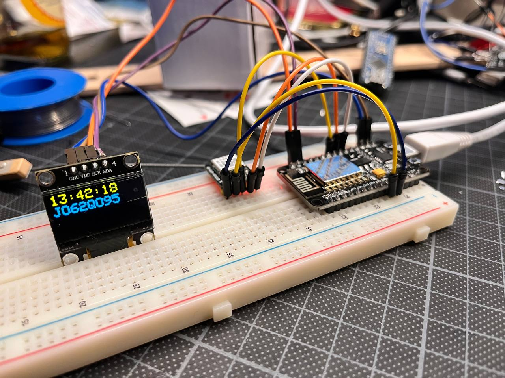

# ESP-NTP-LocClock

Dieses Projekt umfasst die Entwicklung eines Arduino-basierten Systems, das verschiedene Informationen auf einem Adafruit SSD1306 OLED-Display anzeigt. Die Hauptkomponenten und Funktionen des Projekts sind wie folgt:

## Hardware-Komponenten:
- **Arduino-kompatibles Board**: Dient als zentrale Steuereinheit des Projekts.
- **GPS-Modul**: Ermöglicht die Erfassung von GPS-Daten wie Uhrzeit, Breiten- und Längengrad sowie Höhe.
- **Adafruit SSD1306 OLED-Display**: Zeigt die gesammelten Daten und Symbole an.
- **WiFi-Modul (ESP8266)**: Ermöglicht die Netzwerkkonnektivität und die Verwendung von NTP (Network Time Protocol) zur Zeitsynchronisation.

## Software und Funktionen:
- **GPS-Datenverarbeitung**: Erfasst und verarbeitet GPS-Daten, um Uhrzeit, geografische Koordinaten und Höhe zu bestimmen.
- **Anzeige von Uhrzeit und Datum**: Nutzt GPS-Daten, um die aktuelle Uhrzeit und das Datum anzuzeigen. Berücksichtigt auch die Sommerzeit.
- **Locator-Berechnung**: Wandelt GPS-Koordinaten in ein Locator-Format (z.B. Maidenhead Locator System) um und zeigt dieses an.
- **Wechselnde Anzeigen**: Wechselt alle 10 Sekunden zwischen der Anzeige des Locators und der geografischen Koordinaten.
- **Symbolanzeige**: Zeigt verschiedene Symbole auf dem OLED-Display an, um die Art der dargestellten Daten zu kennzeichnen (z.B. Uhrensymbol für Zeit, Bergsymbol für Höhe, Satellitensymbol für GPS-Signalstärke).
- **Netzwerkanbindung**: Verbindet sich über WiFi mit einem Netzwerk und unterstützt NTP zur Zeitsynchronisation.
- **Benutzerdefinierte Grafiken**: Zeichnet benutzerdefinierte Symbole auf dem OLED-Display, um verschiedene Datenarten visuell darzustellen.

## Benutzerinteraktion und Anzeige:
- Das System zeigt Informationen auf dem OLED-Display in einer klaren und lesbaren Weise an.
- Die Anzeige wechselt dynamisch zwischen verschiedenen Datentypen, um eine Vielzahl von Informationen bereitzustellen.

## Programmierung und Code-Struktur:
- Der Arduino-Code steuert die Hardware, verarbeitet die GPS-Daten und steuert das OLED-Display.
- Der Code beinhaltet Funktionen zum Zeichnen von Symbolen, zur Verarbeitung von GPS-Daten und zur Handhabung der WiFi-Verbindung.

## Zusammenfassung:
Dieses Projekt kombiniert Hardware-Interaktion, Datenverarbeitung und grafische Anzeige, um ein multifunktionales Gerät zu schaffen, das nützliche Informationen wie Zeit, geografische Lage und Netzwerkstatus anzeigt. Es ist ein Beispiel für die Integration verschiedener Technologien in einem einzigen System, das für Bildungs-, Hobby- oder praktische Anwendungen nützlich sein kann.

## Disclaimer
Dieses Projekt ist ein Teil der Entwicklungen des IG Hamspirit e.V. und wurde von der Community für Bildungs- und Hobbyzwecke zur Verfügung gestellt. Es dient der Förderung technischer Fähigkeiten und des Wissensaustauschs im Amateurfunkbereich. Siehe: https://www.ighamspirit.de/Projekte

